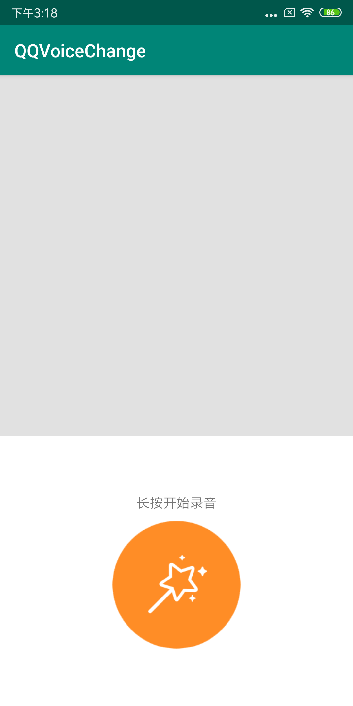
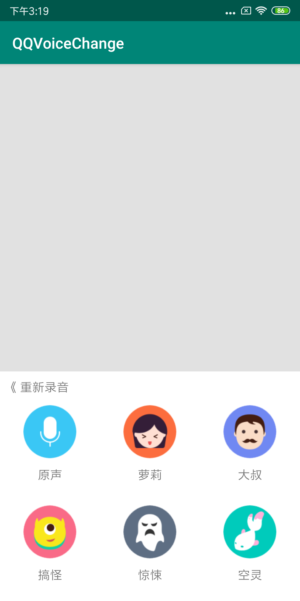

# AndroidStudio下集成Fmod，实现仿QQ变声效果（二）

## 前言
**前一篇博客，我们简单了解了一下 fmod 音频引擎，实现了使用 fmod 来进行音频播放，今天我们在上一个项目的基础上来实现仿QQ变声的效果**

## 一、Android 布局及点击事件实现

### 1、页面布局

**简单的进行页面布局，有两个布局，一个是录音界面，长按按钮录音，显示录音时长；另一个是录音完成之后，对声音进行音效处理的界面，包含原声、萝莉、大叔、搞怪、空灵、惊悚六个按钮，并添加了一个返回重新录音的按钮。界面效果如下：**





### 2、长按录音事件
**在这里，我使用了一个录音的工具类，然后处理录音按钮的触摸事件，判断按下和松开的事件，来进行录音，需要录音和存储权限（注意6.0以上动态检查权限，7.0的文件读取权限）**

**在使用录音文件播放的时候，第一次是录音生成amr文件，是压缩后的文件，导致在使用 fmod 处理音效以及播放时失败，不能播放出声音，最后换成mav文件，在可以进行音效处理。**

#### 2.1 权限判断
判断是否获取了录音权限和文件存储权限

```
    /**
     * 获取权限
     */
    private void requestPermission() {
        if (Build.VERSION.SDK_INT >= Build.VERSION_CODES.M) {
            String[] perms = {"android.permission.RECORD_AUDIO", "android.permission.WRITE_EXTERNAL_STORAGE"};
            if (checkSelfPermission(perms[0]) == PackageManager.PERMISSION_DENIED ||
                    checkSelfPermission(perms[1]) == PackageManager.PERMISSION_DENIED) {
                permission = false;
                requestPermissions(perms, 200);
            } else {
                permission = true;
            }
        }
    }

```

#### 2.2 处理长按录音效果
```
    
    public class MyHandler extends Handler {
        @Override
        public void handleMessage(Message msg) {
            super.handleMessage(msg);
            switch (msg.what) {
                case RECORD_START:
                    try {
                        audioRecordUtils.startRecordAndFile();
                        recording = true;
                    } catch (Exception e) {
                        e.printStackTrace();
                        recording = false;
                        requestPermission();
                    }
                    break;
                case RECORD_FINISH:
                    recording = false;
                    audioRecordUtils.stopRecordAndFile();
                    break;
                case RECORD_CANCEL:
                    audioRecordUtils.stopRecordAndFile();
                    recording = false;
                    break;
            }
        }
    }
    
    @Override
    protected void onCreate(Bundle savedInstanceState) {
        super.onCreate(savedInstanceState);
        setContentView(R.layout.activity_main);
        org.fmod.FMOD.init(this);
        audioRecordUtils = AudioRecordUtils.getInstance();
        audioRecordUtils.setOnAudioStatusUpdateListener(this);
        recordBtn = findViewById(R.id.recordBtn);
        recordLl = findViewById(R.id.recordLl);
        recordTimeTv = findViewById(R.id.recordTimeTv);
        recordBtn.setOnTouchListener(this);
        effectUtils = new EffectUtils();
        requestPermission();
    }
    
    @Override
    public boolean onTouch(View view, MotionEvent motionEvent) {
        switch (motionEvent.getAction()) {
            case MotionEvent.ACTION_DOWN:
                if (permission) {
                    handler.sendEmptyMessage(RECORD_START);
                } else {
                    Toast.makeText(this, "请先同意录音和存储功能权限后使用", Toast.LENGTH_SHORT).show();
                    requestPermission();
                }
                break;
            case MotionEvent.ACTION_UP:
                if (recording) {
                    if (mTime < 1000) {
                        handler.sendEmptyMessage(RECORD_CANCEL);
                    }

                    handler.sendEmptyMessage(RECORD_FINISH);
                } else {
                    super.onTouchEvent(motionEvent);
                }
                break;
        }
        return true;
    }
    
    /**
     * 录音中
     */
     @Override
    public void onUpdate(double db, AudioRecordUtils.RecordTimes times) {
        this.mTime = times.getTime();
        recordTimeTv.setText("... " + times.getFormatTime("mm:ss") + " ...");
    }

    

    /**
     * 录音完成
     */
    @Override
    public void onFinish(float seconds, String filePath) {
        recordFilePath = filePath;
        recordLl.setVisibility(View.GONE);
    }

```

## 二、NDK实现音效

### 1、native 方法声明
**创建 org.fmod.core.EffectUtils.java 文件，声明音效变换的 native 方法，并且定义音效类型常量**

```
    public static final int MODE_NORMAL = 0;
    public static final int MODE_LUOLI = 1;
    public static final int MODE_DASHU = 2;
    public static final int MODE_GAOGUAI = 3;
    public static final int MODE_KONGLING = 4;
    public static final int MODE_JINGSONG = 5;
     /**
     * 音效处理 native 方法
     * @param path 音频源文件路径
     * @param mode 特效模式
     */
    public native void effect(String path,int mode);
```

### 2、生成头文件,处理Android页面的点击事件
**进入app/src/main/java目录下使用javah命令将创建好的org.fmod.core.EffectUtils.java 编译生成.h 头文件;并将该头文件移动到 cpp 目录下**

```
javah -encoding utf-8 org.fmod.core.EffectUtils
```

Android 页面点击事件

```
    /**
     * 按钮点击事件
     * @param view
     */
    public void onClick(View view) {
        switch (view.getId()) {
            case R.id.reRecordTv:
                recordTimeTv.setText("长按开始录音");
                recordLl.setVisibility(View.VISIBLE);
                break;
            case R.id.normalLL:
            effectUtils.effect(recordFilePath,EffectUtils.MODE_NORMAL);
                break;
            case R.id.luoliLL:
                effectUtils.effect(recordFilePath,EffectUtils.MODE_LUOLI);
                break;
            case R.id.dashuLL:
                effectUtils.effect(recordFilePath,EffectUtils.MODE_DASHU);
                break;
            case R.id.gaoguaiLL:
                effectUtils.effect(recordFilePath,EffectUtils.MODE_GAOGUAI);
                break;
            case R.id.konglingLL:
                effectUtils.effect(recordFilePath,EffectUtils.MODE_KONGLING);
                break;
            case R.id.jingsongLL:
                effectUtils.effect(recordFilePath,EffectUtils.MODE_JINGSONG);
                break;
        }
    }
```

### 3、native 实现
**在 cpp 目录下创建 effect.cpp 文件，来实现 native 方法，并将 CMakeLists.txt 中的配置稍作修改**

CMakeLists.txt

```
cmake_minimum_required(VERSION 3.4.1)

set(distribution_DIR ${PROJECT_SOURCE_DIR}../../jniLibs)
include_directories(src/main/cpp/inc)

add_library( effect
        SHARED
        effect.cpp)

add_library( fmod
        SHARED
        IMPORTED )
set_target_properties( fmod
        PROPERTIES IMPORTED_LOCATION
        ${distribution_DIR}/${ANDROID_ABI}/libfmod.so)

add_library( fmodL
        SHARED
        IMPORTED )
set_target_properties( fmodL
        PROPERTIES IMPORTED_LOCATION
        ${distribution_DIR}/${ANDROID_ABI}/libfmodL.so )

find_library( 
        log-lib
        log)

target_link_libraries( effect
        fmod
        fmodL
        ${log-lib} )

```

effect.cpp 

```

#include "org_fmod_core_EffectUtils.h"
#include "inc/fmod.h"
#include "inc/fmod.hpp"
#include <string.h>
#include <unistd.h>
#include <android/log.h>

#define LOGI(FORMAT, ...) __android_log_print(ANDROID_LOG_INFO,"FILE_PATCH",FORMAT,__VA_ARGS__);
#define LOGE(FORMAT, ...) __android_log_print(ANDROID_LOG_ERROR,"FILE_PATCH",FORMAT,__VA_ARGS__);

JNIEXPORT void JNICALL Java_org_fmod_core_EffectUtils_effect
        (JNIEnv *env, jobject jobj, jstring j_file_path, jint j_mode) {
    //路径转换
    const char *file_path = env->GetStringUTFChars(j_file_path, NULL);
    bool playing = true;
    //加载音频文件
    FMOD::System *system;
    FMOD::Sound *sound;
    FMOD::Channel *channel;
    FMOD::DSP *dsp;
    float frequency;
    try {
        //初始化
        System_Create(&system);
        system->init(32, FMOD_INIT_NORMAL, NULL);
        LOGI("%s", file_path);
        //加载录音文件到 sound
        system->createSound(file_path, FMOD_DEFAULT,NULL, &sound);
        //播放音频文件
        system->playSound(sound, 0, false, &channel);
        //播放过程中实现不同的音效配置
        //在fmod中，处理音效就是更改channel（音轨）
        switch (j_mode) {
            case org_fmod_core_EffectUtils_MODE_NORMAL:
                //无需处理
                LOGI("%s", "正常播放");

                break;
            case org_fmod_core_EffectUtils_MODE_LUOLI:
                //女声为高声，需要将声音提高
                //DSP 中定义了一些对声音处理的特效，
                system->createDSPByType(FMOD_DSP_TYPE_PITCHSHIFT, &dsp);
                dsp->setParameterFloat(FMOD_DSP_PITCHSHIFT_PITCH, 2.5);
                channel->addDSP(0, dsp);
                LOGI("%s", "萝莉")
                break;
            case org_fmod_core_EffectUtils_MODE_DASHU:
                //大神为高声，需要将声音音效降低
                //DSP 中定义了一些对声音处理的特效，
                system->createDSPByType(FMOD_DSP_TYPE_PITCHSHIFT, &dsp);
                dsp->setParameterFloat(FMOD_DSP_PITCHSHIFT_PITCH, 0.6);
                channel->addDSP(0, dsp);
                LOGI("%s", "大叔")
                break;
            case org_fmod_core_EffectUtils_MODE_GAOGUAI:
                //搞怪
                //提高说话的速度
                channel->getFrequency(&frequency);
                frequency = frequency * 1.6;
                channel->setFrequency(frequency);
                LOGI("%s", "搞怪")
                break;
            case org_fmod_core_EffectUtils_MODE_KONGLING:
                //空灵就是产生回声，外加一点低音
                system->createDSPByType(FMOD_DSP_TYPE_PITCHSHIFT, &dsp);
                dsp->setParameterFloat(FMOD_DSP_PITCHSHIFT_PITCH, 0.9);
                channel->addDSP(0, dsp);
                system->createDSPByType(FMOD_DSP_TYPE_ECHO, &dsp);
                dsp->setParameterFloat(FMOD_DSP_ECHO_DELAY, 350);
                dsp->setParameterFloat(FMOD_DSP_ECHO_FEEDBACK, 15);
                channel->addDSP(1, dsp);
                LOGI("%s", "空灵")
                break;
            case org_fmod_core_EffectUtils_MODE_JINGSONG:
                //惊悚
                system->createDSPByType(FMOD_DSP_TYPE_TREMOLO, &dsp);
                dsp->setParameterFloat(FMOD_DSP_TREMOLO_DEPTH, 0.5);
                channel->addDSP(0,dsp);
                LOGI("%s", "惊悚")
                break;
            default:
                break;

        }

    } catch (...) {
        LOGE("%s", "effect error");
        goto end;
    }
    //更新状态
    system->update();
    //判断是否在播放
    while (playing) {
        LOGI("%s,%d", "playing",playing)
        channel->isPlaying(&playing);
        usleep(1 * 1000 * 1000);
        LOGI("%s,%d", "playing",playing)
    }

    goto end;
    //结束，释放资源
    end:
    env->ReleaseStringUTFChars(j_file_path, file_path);
    sound->release();
    system->close();
    system->release();
}
```

### 4、附表
#### 4.1 DSP_TYPE 类型说明
**在创建DSP时，system->createDSPByType(FMOD_DSP_TYPE_PITCHSHIFT, &dsp);  需要传递FMOD_DSP_TYPE,下面介绍一下DSP_TYPE 类型**
类型名称 | 说明
--- | ---
FMOD_DSP_TYPE_UNKNOWN | 此单元是通过非FMOD插件创建的，因此具有未知目的。 
FMOD_DSP_TYPE_MIXER | 此单元除了接收输入并将它们混合在一起然后将结果提供给声卡单元之外什么都不做。 
FMOD_DSP_TYPE_OSCILLATOR | 此单元生成正弦/方波/锯/三角形或噪声音。 
FMOD_DSP_TYPE_LOWPASS | 此单元使用高质量的谐振低通滤波器算法过滤声音，但消耗更多的CPU时间。已弃用，将在以后的版本中删除（有关替代版本，请参阅FMOD_DSP_LOWPASS备注）。 
FMOD_DSP_TYPE_ITLOWPASS | 此单元使用脉冲跟踪器中使用的谐振低通滤波器算法过滤声音，但截止范围有限（0到8060hz）。 
FMOD_DSP_TYPE_HIGHPASS | 此单元使用谐振高通滤波器算法过滤声音。已弃用，将在以后的版本中删除（有关替代版本，请参阅FMOD_DSP_HIGHPASS备注）。  
FMOD_DSP_TYPE_ECHO | 此单元在声音上产生回声并以所需速率淡出。 
FMOD_DSP_TYPE_FADER | 此单位平移和缩放单位的音量。 
FMOD_DSP_TYPE_FLANGE | 此单元对声音产生法兰效果。 
FMOD_DSP_TYPE_DISTORTION | 此单位扭曲声音。 
FMOD_DSP_TYPE_NORMALIZE | 此单元将声音标准化或放大到一定水平。 
FMOD_DSP_TYPE_LIMITER | 此单位将声音限制在一定水平。 
FMOD_DSP_TYPE_PARAMEQ | 此单元衰减或放大选定的频率范围。已弃用，将在以后的版本中删除（有关替代版本，请参阅FMOD_DSP_PARAMEQ备注）。 
FMOD_DSP_TYPE_PITCHSHIFT | 此单位在不改变播放速度的情况下弯曲声音的音高。 
FMOD_DSP_TYPE_CHORUS | 此单位对声音产生合唱效果。 
FMOD_DSP_TYPE_VSTPLUGIN | 此单元允许使用Steinberg VST插件
FMOD_DSP_TYPE_WINAMPPLUGIN | 此单元允许使用Nullsoft Winamp插件
FMOD_DSP_TYPE_ITECHO | 此单元在声音上产生回声，并以Impulse Tracker中使用的所需速率淡出。 
FMOD_DSP_TYPE_COMPRESSOR | 此单元实现动态压缩（链接/非链接多声道，宽带）
FMOD_DSP_TYPE_SFXREVERB | 此单元实现SFX混响
FMOD_DSP_TYPE_LOWPASS_SIMPLE | 此单元使用简单的低通滤波器进行声音滤波，无谐振，但具有灵活的截止频率且速度快。已弃用，将在以后的版本中删除（有关替代版本，请参阅FMOD_DSP_LOWPASS_SIMPLE备注）。 
FMOD_DSP_TYPE_DELAY | 此单元在声音的各个声道上产生不同的延迟。 
FMOD_DSP_TYPE_TREMOLO | 此单元对声音产生颤音/斩波效果。 
FMOD_DSP_TYPE_LADSPAPLUGIN | 不支持/不推荐使用。 
FMOD_DSP_TYPE_SEND | 该单元将信号的副本发送到DSP树中任何位置的返回DSP。 * /
FMOD_DSP_TYPE_RETURN | 本机接收来自多个发送DSP的信号。 
FMOD_DSP_TYPE_HIGHPASS_SIMPLE | 此单元使用简单的高通滤波器无声共振，但具有灵活的截止频率且速度快。已弃用，将在以后的版本中删除（有关替代版本，请参阅FMOD_DSP_HIGHPASS_SIMPLE备注）。 
FMOD_DSP_TYPE_PAN | 此单元平移信号，也可能是上混或下混。 
FMOD_DSP_TYPE_THREE_EQ | 此单元是三频段均衡器。 
FMOD_DSP_TYPE_FFT | 该单元简单地分析信号并通过getParameter提供频谱信息。 * /
FMOD_DSP_TYPE_LOUDNESS_METER | 此单元分析信号的响度和真峰值。 
FMOD_DSP_TYPE_ENVELOPEFOLLOWER | 此单元跟踪输入/侧链信号的包络。已弃用，将在以后的版本中删除。 
FMOD_DSP_TYPE_CONVOLUTIONREVERB | 此单元实现卷积混响。 
FMOD_DSP_TYPE_CHANNELMIX | 此单元提供每信号通道增益和输出通道映射，以允许由多组信号组成的1个多通道信号映射到单个输出信号。 
FMOD_DSP_TYPE_TRANSCEIVER | 此单元从最多32个不同的插槽中选择“发送”和“接收”。它就像发送/返回，但它使用全局槽而不是返回作为目标。它还有其他功能。多个收发器可以从单个通道接收，或者多个收发器可以发送到单个通道，或两者的组合。 
FMOD_DSP_TYPE_OBJECTPAN | 此单元将信号发送到3d对象编码器，如Dolby Atmos。支持FMOD_D的子集

#### 4.2 DSP 的参数类型
**在设置 DSP 的参数类型时，可在 fmod_dsp_effects.h 头文件中查询对应的 DSP类型，即可看到对应的参数类型**

如：FMOD_DSP_TREMOLO,在头文件中查到如下内容

```
typedef enum
{
    FMOD_DSP_TREMOLO_FREQUENCY,     /* (Type:float) - LFO frequency in Hz.  0.1 to 20.  Default = 5. */
    FMOD_DSP_TREMOLO_DEPTH,         /* (Type:float) - Tremolo depth.  0 to 1.  Default = 1. */
    FMOD_DSP_TREMOLO_SHAPE,         /* (Type:float) - LFO shape morph between triangle and sine.  0 to 1.  Default = 0. */
    FMOD_DSP_TREMOLO_SKEW,          /* (Type:float) - Time-skewing of LFO cycle.  -1 to 1.  Default = 0. */
    FMOD_DSP_TREMOLO_DUTY,          /* (Type:float) - LFO on-time.  0 to 1.  Default = 0.5. */
    FMOD_DSP_TREMOLO_SQUARE,        /* (Type:float) - Flatness of the LFO shape.  0 to 1.  Default = 0. */
    FMOD_DSP_TREMOLO_PHASE,         /* (Type:float) - Instantaneous LFO phase.  0 to 1.  Default = 0. */
    FMOD_DSP_TREMOLO_SPREAD         /* (Type:float) - Rotation / auto-pan effect.  -1 to 1.  Default = 0. */
} FMOD_DSP_TREMOLO;

```

DSP 参数类型 | 说明
--- | ---
FMOD_DSP_TREMOLO_FREQUENCY | （类型：浮点） - 以Hz为单位的LFO频率。 0.1至20.默认= 5. 
FMOD_DSP_TREMOLO_DEPTH | （类型：浮点） - 颤音深度。 0到1.默认= 1. * / 
FMOD_DSP_TREMOLO_SHAPE | （类型：浮点） - 三角形和正弦之间的LFO形状变形。 0到1.默认= 0. 
FMOD_DSP_TREMOLO_SKEW | （类型：浮点） - LFO周期的时间偏移。 -1到1.默认值= 0. 
FMOD_DSP_TREMOLO_DUTY | （类型：浮点） - LFO开启时间。 0到1.默认值= 0.5。
FMOD_DSP_TREMOLO_SQUARE | （类型：浮点） - LFO形状的平坦度。 0到1.默认= 0. 
FMOD_DSP_TREMOLO_PHASE | （类型：浮点） - 瞬时LFO相位。 0到1.默认= 0. * / FMOD_DSP_TREMOLO_SPREAD  | （类型：浮点） - 旋转/自动平移效果。 -1到1.默认值= 0. 


## 项目源码
[QQVoiceChange源码](https://github.com/onestravel/QQVoiceChange)

**到此，我们以及实现集成 fmod 的模拟QQ变声项目，效果不是完全一样，但也有7分相似，；自己可研究其他效果，来实现模拟更多的声音特效。**
